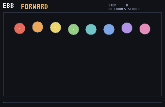
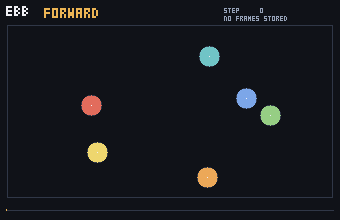

# ebb

A 2D physics simulation that runs backwards bit-for-bit without stored frames.

> Scatter a handful of balls for ten thousand steps, then run time backwards — every
> ball retraces its exact path to where it started, and no frames were saved to make
> that happen.

## Demo

Eight balls are let go in a row, bounce around for 2,400 steps, and then the
simulation is stepped backwards. The rings mark where each ball started. No frame
of the forward run was stored: the backward path is computed, not replayed.



The same thing without gravity, where contact is the only thing happening:



Both animations were produced by `python3 demo/make_demo.py`, which compares the
whole integer state before and after and refuses to write a GIF if the reverse run
does not land exactly on the start state.

## Closest prior art

**Closest prior art:** Jos Stam, *An Exact Bitwise Reversible Integrator*
([arXiv:2207.07695](https://arxiv.org/abs/2207.07695)), which integrates Hamiltonian
systems in fixed-point arithmetic so a run can be stepped forward and back bitwise
exactly; and Kalyan S. Perumalla & Vladimir A. Protopopescu, *Reversible Simulations
of Elastic Collisions* ([arXiv:1302.1126](https://arxiv.org/abs/1302.1126)), which
recovers pre-collision state for identical hard spheres with essentially no memory
overhead. Bit-reversible integer integrators go back to Levesque & Verlet, and
[JANUS](https://arxiv.org/abs/1704.07715) applies one to N-body dynamics.

**Difference:** Stam's integrator covers smooth forces — the words *collision*,
*contact*, *rigid* and *friction* do not appear in the paper — and its application is
the reverse step of the adjoint method. Perumalla & Protopopescu cover collisions but
for identical frictionless hard spheres, with perfect reversibility reported for
restricted cases (n ≤ 3 in 2D), in a parallel discrete-event simulation context rather
than as an engine. `ebb` is aimed at the part they each leave out: contact dynamics in
which the step itself is a bijection, with the information that rounding destroys
measured rather than assumed. Deterministic game-physics engines such as
[Rapier](https://rapier.rs/docs/user_guides/javascript/determinism/) and
[SG Physics 2D](https://gitlab.com/snopek-games/sg-physics-2d) are the closest match on
use case; they achieve rewind by storing a frame and restoring it later.

**Search confidence:** Medium.
**Scope:** This assessment reflects the sources and queries documented in
[`NOVELTY_REPORT.md`](NOVELTY_REPORT.md).

## How it works

The state is integers: fixed-point positions and velocities, 65,536 sub-units to the
world unit, and no floating point anywhere in the step. A step is built only out of
pieces that are bijections, so the step is a bijection and has an exact inverse.

1. **Kick** — `v += g`. Inverted by subtracting the same constant.
2. **Drift with walls** — `x += v`, then mirror back into the box. The obvious mirror
   rule is *not* invertible on an integer lattice: a body sitting on the wall moving
   outwards and the same body moving inwards can land on the same state, so the
   post-state does not say which happened. Reflecting about the half-unit just
   *outside* the wall separates the cases completely. After the step, `x - v` lies
   inside the box, above it, or below it, and those three ranges are disjoint — so the
   backward pass reads off which reflection occurred with nothing stored.
3. **Contact** — every overlapping pair exchanges the component of relative velocity
   along the line of centres. Positions are not touched, so the set of overlapping
   pairs is identical before and after, which is what lets the backward pass find
   exactly the pairs the forward pass resolved.

Contact is the one place information is destroyed, because the exchange divides by the
squared distance between the centres and integer division discards a remainder. Exactly
one integer per contact is written to a **residue tape**: the relative normal speed
before the exchange plus the one after, which in exact arithmetic would always be zero.
Nothing per frame, nothing per body. A scene with one ball writes nothing at all.

## Current status

Milestone 1 of six. What exists today is what is described above and nothing more:

**Works now**
- Discs, gravity, walls, elastic disc-disc contact, in integer fixed-point arithmetic.
- `step()` and `unstep()` as exact inverses, verified over 100,000 steps.
- Rewinding to any intermediate frame, not only to the start.
- Determinism: identical states and identical tapes across runs.
- A GIF writer and rasteriser, written here because no image library is installed.

**Not built yet**
- **Rotation and polygons.** Everything is a disc with no angular state. Rotation is
  where reversibility is most likely to break, and it is milestone 3 precisely because
  it can invalidate the approach.
- **Friction and restitution.** Contact is elastic. Dissipation destroys information by
  definition, so making it reversible means writing what it destroys to the tape, and
  measuring that cost. Milestone 4.
- **Resting contact.** Bodies that settle into a pile do not rest — milestone 1
  resolves *every* overlapping pair on *every* step, so a pair that stays overlapped
  has its relative normal velocity exchanged repeatedly. Measured over 5,000 steps:
  in the no-gravity scene 0% of contact events are repeats of an already-overlapping
  pair, in the falling-balls scene 67.5%, and in the 14-body scene 92.0%. It is
  reversible, and it is not good contact physics. Milestone 2 replaces the rule with
  one that keeps bodies from overlapping at all.
- **A browser page, and a second implementation** of the kernel to cross-check the
  first. Milestone 5.

The milestone ladder and the definition of done are in [`../../TASKS.json`](../../TASKS.json).

## Usage

No dependencies and no installation required — Python 3.8 or newer, standard library
only. From this directory:

```python
from ebb import World
from ebb.scenes import drop

world = drop()               # 8 balls, in a box, under gravity
start = world.state()        # a tuple of ints: time, positions, velocities

world.run(10_000)            # step forwards
world.unrun(10_000)          # step backwards

assert world.state() == start        # exact, not approximate
assert len(world.tape) == 0          # nothing left over
```

Building a scene directly:

```python
from ebb import World

world = World.from_units((0, 0, 12, 8), gravity=(0.0, -0.004))
world.add_disc_units(x=3.0, y=6.0, vx=0.05, vy=0.0, r=0.4)
world.add_disc_units(x=7.0, y=6.0, vx=-0.03, vy=0.0, r=0.4)
world.run(500)
```

Regenerate the demos and the evidence:

```sh
python3 demo/make_demo.py                          # writes demo/*.gif
python3 evidence/run_evidence.py > evidence/results.md
```

Installing as a package is optional: `pip install .` works and was checked in a fresh
virtualenv.

## Validation

Run the tests from this directory:

```sh
python3 -m unittest discover -s tests -t .
```

45 tests, all passing, covering the reversible kernel, the GIF writer and the
rasteriser. What they check:

- **Round trips are exact**, on four scenes at 10,000 steps and on the falling-balls
  scene at 100,000 steps: the whole integer state is compared, never a tolerance.
- **The wall rule is checked by enumeration**, not by example: every position on a
  41-cell axis against every velocity it accepts — 3,321 states, 3,321 distinct images,
  0 collisions, all 3,321 inverted exactly. A second test runs the same enumeration on
  the rule *without* the half-unit offset and requires it to fail, so the reason the
  offset exists cannot be optimised away silently.
- **Controls.** One ball, which can never contact anything, leaves the tape at zero
  bytes. Two runs of the same scene produce identical states and identical tapes.
  Contact conserves momentum exactly, checked on a contact constructed to be certain
  to occur. In the elastic scene, kinetic energy moved by 0.042% over 10,000 steps —
  that residual is the integer rounding the tape records.
- **Failure handling.** A body moving further in one step than the box is wide raises
  rather than being clamped, because clamping is not invertible. Stepping backwards
  without the residue tape raises rather than producing a wrong state.
- **The GIF writer is checked against a decoder written separately from the
  specification**, which shares no code with the encoder, and — when Pillow happens to
  be installed — against Pillow as well, which decoded every frame to the exact pixels
  encoded. The project itself has no dependencies; that check skips if Pillow is absent.

All numbers quoted in this README come from `evidence/results.md`, which is regenerated
by `python3 evidence/run_evidence.py`. They were measured on Python 3.11.15, Linux
x86_64, single-threaded.

### What has not been measured

No comparison of speed against any other physics engine has been made, and none is
claimed. The storage comparison in the evidence file is a storage comparison only: it
counts the bytes of the residue tape against the bytes a snapshot of every frame would
take, using the same encoding on both sides.

## License

See [`LICENSE.txt`](LICENSE.txt), the license this repository uses for every project.
